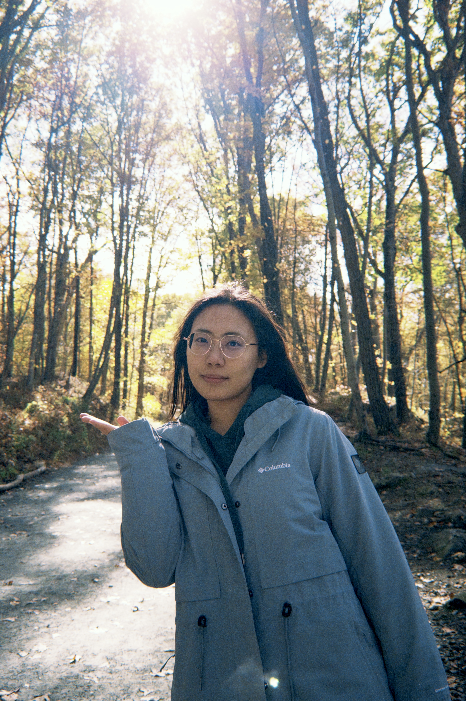

Here're some Yimeng Wang's  Wonderful Academic and Professional Experiences：

## Yimeng Wang

{width=300px}

## EDUCATION

### Columbia University

*M.S. Biostatistics (Data Science)* | 09/2025-05/2027

### Beijing Normal University

*B.Eng. Ecological Engineering of Environment* | 09/2021-06/2025

## ACADEMIC EXPERIENCES

### Undergraduate Thesis

▸**Response of Soil Microbial Communities to Oil Drilling Lubricant Leachate**| 05/2025

*Analyzed 16S/ITS sequencing data in R to assess microbial diversity and applied βNTI/neutral community models, revealing a contaminant-driven shift to deterministic assembly (βNTI > 2), providing key mechanistic insight for ecological risk assessment.*

### Student Researcher

▸**Cadmium Contamination and Microbial Network Stability** | 09/2023–05/2024

*Investigated Cd's impact on microbial networks by analyzing 16S rRNA data and constructing co-occurrence networks in R (random Forest), quantifying a up to 24% reduction in nodes/links and identifying keystone taxa (e.g., Flavobacteria); findings contributed to a co-authored paper in Journal of Hazardous Materials.*

▸**Presence of Commonly Used Drugs in Beijing Wastewater Treatment Plants** | 12/2022–05/2024

*Developed a validated LC-MS/MS method (93-133% recovery) to quantify 11 drugs in 64 wastewater samples; performed time-series analysis in R and ecological risk assessment, identifying a high risk of ibuprofen to algae (RQ ≈ 1.7).*

## INTERNSHIP

**China Green Foundation — Data Intern** | 07/2024-10/2024

*Cleaned, organized, and summarized project-related datasets in Excel; supported quantitative report preparation.*

## AWARDS

 - *Meritorious Winner: Mathematical Contest in Modeling (MCM)* | 02/2024

 - *Multiple Merit Scholarships: Beijing Normal University* | 2021-2025

## SKILLS

✓ **Tools**

*R (tidyverse, ggplot2, dplyr), Java (basic), SPSS, Excel*

✓ **Statistical methods**

*regression, hypothesis testing, time-series analysis, biostatistics, ecological risk assessment*

GO BACK TO [HOMEPAGE](index.html)
